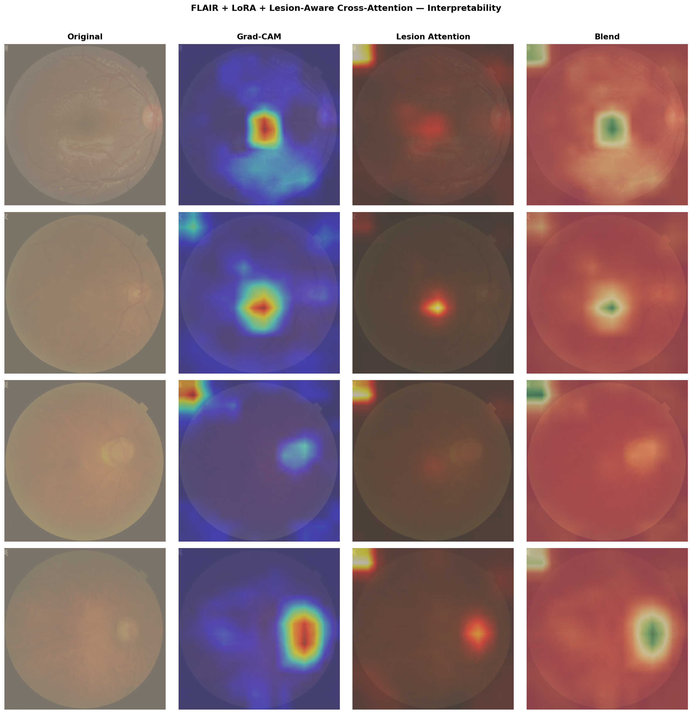
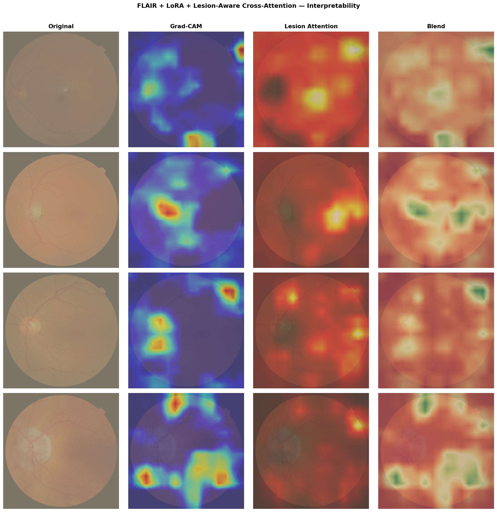
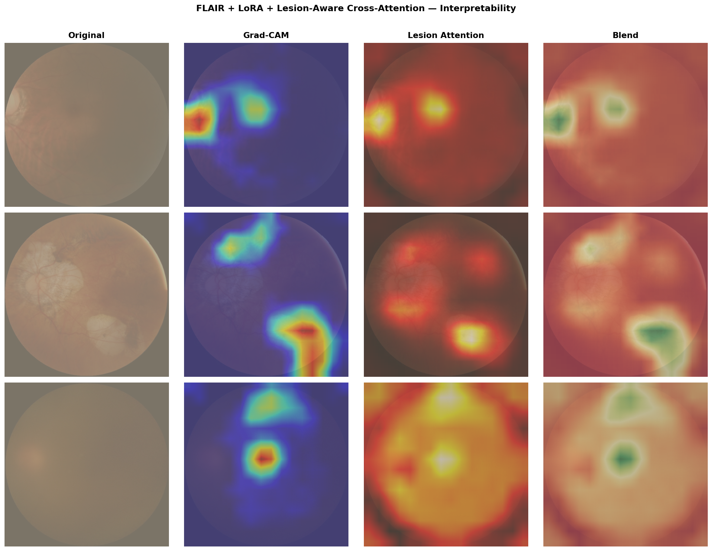

# Lesion-Aware Vision–Language Learning for Interpretable Retinal Disease Diagnosis

**M.Tech Thesis — Indian Institute of Information Technology, Allahabad**  
**Student:** Jai Kumar Sabliya (MHC2024011)

---

## Overview

This repository extends the [FLAIR](https://github.com/jusiro2/FLAIR) foundation model for retinal image analysis with two novel contributions:

1. **LoRA Adaptation** — Parameter-efficient fine-tuning of the ResNet-50 vision encoder using Low-Rank Adaptation (rank-4), adding only ~65K trainable parameters instead of retraining the full model.

2. **Lesion-Aware Cross-Attention** — A cross-attention module that grounds visual representations in 16 clinical lesion concepts (microaneurysms, haemorrhages, drusen, optic disc cupping, etc.), producing interpretable, lesion-grounded embeddings for classification.

Together, these contributions improve both classification accuracy and clinical interpretability across three benchmark retinal datasets.

---

## Architecture

```
Input Image
    ↓
ResNet-50 (layer1 → layer2 → layer3* → layer4*)   * LoRA adapters here
    ↓                              ↓
Global avg pool           Spatial feature map (7×7)
                                   ↓
                    Lesion Cross-Attention
                    (16 lesion text queries)
                                   ↓
                         Enhanced embedding
                                   ↓
               Cosine similarity with text prototypes → Class
```

**Training strategy (two-stage):**
- **Warmup (epochs 1–3):** Lesion Attention only; LoRA frozen
- **Joint (epochs 4–10):** LoRA + Lesion Attention trained together

---

## Results

All experiments use 3-fold cross-validation (80/20 split).

| Method | Dataset | ACA | Kappa | F1 (Macro) |
|--------|---------|-----|-------|------------|
| FLAIR Zero-Shot | FIVES | 0.750 | 0.560 | 0.747 |
| FLAIR + LoRA | FIVES | 0.871 ± 0.021 | 0.797 ± 0.032 | 0.871 ± 0.021 |
| **FLAIR + LoRA + LesionAttn** | **FIVES** | **0.892 ± 0.008** | **0.837 ± 0.060** | **0.891 ± 0.008** |
| FLAIR Zero-Shot | MESSIDOR | 0.614 | 0.764 | — |
| FLAIR + LoRA | MESSIDOR | 0.675 ± 0.034 | 0.869 ± 0.016 | 0.686 ± 0.032 |
| **FLAIR + LoRA + LesionAttn** | **MESSIDOR** | **0.685 ± 0.027** | **0.842 ± 0.010** | **0.680 ± 0.023** |
| FLAIR Zero-Shot | ODIR-5K | 0.630 | 0.406 | — |
| FLAIR + LoRA | ODIR-5K | 0.931 ± 0.014 | 0.874 ± 0.025 | 0.931 ± 0.014 |
| **FLAIR + LoRA + LesionAttn** | **ODIR-5K** | **0.944 ± 0.010** | **0.890 ± 0.016** | **0.945 ± 0.010** |

---

## Interpretability — Grad-CAM Visualisations

The model produces four-panel visualisations per image: Original | Grad-CAM | Lesion Attention | Blend.

**FIVES (4-class: Normal / AMD / DR / Glaucoma)**


**MESSIDOR (DR severity grading)**


**ODIR-5K (Normal / Myopia / Cataract)**


---

## Repository Structure

```
FLAIR/
├── flair/
│   ├── modeling/               # Base FLAIR model (ResNet-50 + ClinicalBERT)
│   ├── transferability/
│   │   ├── data/               # Dataloaders and transforms
│   │   └── modeling/
│   │       ├── lesion_attention.py   ← NEW: Lesion Cross-Attention module
│   │       ├── lora.py               ← NEW: LoRA adapter implementation
│   │       ├── finetuning.py
│   │       └── adapters.py
│   └── utils/                  # Loss functions and metrics
├── local_data/
│   ├── experiments.py          # Dataset experiment configs
│   ├── constants.py            # Paths
│   └── results/
│       └── gradcam/            # Grad-CAM visualisation outputs
├── train_lora.py               ← NEW: LoRA training script
├── train_lesion.py             ← NEW: Lesion Attention training script
├── gradcam_viz.py              ← NEW: Grad-CAM + Lesion Attention visualisation
├── main_transferability.py     # Original FLAIR zero-shot evaluation
└── requirements.txt
```

---

## Setup

### 1. Clone the repository

```bash
git clone https://github.com/jaikum0909/FLAIR-Lesion-Aware.git
cd FLAIR-Lesion-Aware
```

### 2. Create environment and install dependencies

```bash
python -m venv flair_env
source flair_env/bin/activate      # Linux/macOS
# flair_env\Scripts\activate       # Windows

pip install -r requirements.txt
pip install -e .
```

### 3. Download datasets

Place datasets under `local_data/datasets/`:

| Dataset | Description | Link |
|---------|-------------|------|
| FIVES | 4-class retinal disease | [FIVES Dataset](https://figshare.com/articles/figure/FIVES_A_Fundus_Image_Dataset_for_AI-based_Vessel_Segmentation/19688169) |
| MESSIDOR | Diabetic Retinopathy grading | [MESSIDOR](https://www.adcis.net/en/third-party/messidor/) |
| ODIR-5K | Ocular Disease Recognition | [ODIR-5K](https://odir2019.grand-challenge.org/) |

### 4. Download FLAIR pre-trained weights

```bash
# Weights are auto-downloaded on first run via HuggingFace Hub
# Model ID: jusiro2/FLAIR
```

---

## Training

### Step 1: Train LoRA (vision encoder adaptation)

```bash
python train_lora.py \
    --experiment 13_FIVES \
    --fold 0 \
    --lora_rank 4 \
    --lora_alpha 8.0 \
    --lora_layers layer3,layer4 \
    --epochs 10 \
    --lr 1e-4
```

### Step 2: Train Lesion-Aware Cross-Attention

```bash
python train_lesion.py \
    --experiment 13_FIVES \
    --fold 0 \
    --lora_rank 4 \
    --lora_alpha 8.0 \
    --hidden_dim 256 \
    --num_heads 8 \
    --warmup_epochs 3 \
    --epochs 10
```

Replace `13_FIVES` with `02_MESSIDOR` or `08_ODIR200x3` for other datasets.

---

## Evaluation & Visualisation

### Run zero-shot baseline

```bash
python main_transferability.py \
    --experiment 13_FIVES \
    --method zero_shot
```

### Generate Grad-CAM + Lesion Attention visualisations

```bash
python gradcam_viz.py \
    --experiment 13_FIVES \
    --fold 0 \
    --n_samples 4 \
    --out_dir local_data/results/gradcam
```

---

## Key Files — New Contributions

### `flair/transferability/modeling/lesion_attention.py`
Implements `LesionAwareFLAIR` — wraps the base FLAIR model with a `LesionCrossAttention` module. The attention module attends the 7×7 spatial feature map from ResNet-50 layer4 against 16 pre-encoded lesion text queries.

### `flair/transferability/modeling/lora.py`
Implements `apply_lora()` — injects low-rank adapter matrices (A, B) into Conv2d layers of the ResNet-50 vision encoder. Rank and target layers are configurable.

### `train_lora.py`
End-to-end LoRA training script with cross-validation support, learning rate scheduling, and checkpoint saving.

### `train_lesion.py`
Two-stage training script: warmup phase (Lesion Attention only) followed by joint training (LoRA + Lesion Attention).

### `gradcam_viz.py`
Gradient-weighted class activation mapping on ResNet-50 layer4 combined with lesion attention maps. Uses `retain_grad()` for gradient capture on non-leaf tensors (required for MPS/CUDA compatibility).

---

## Acknowledgements

This work builds on [FLAIR](https://github.com/jusiro2/FLAIR) by Julio Silva-Rodríguez et al., published in *Medical Image Analysis*.

```bibtex
@article{silva2023flair,
  title={A foundation language-image model of the retina (FLAIR): Encoding expert knowledge in text supervision},
  author={Silva-Rodríguez, Julio and Chakor, Hadi and Kobbi, Riadh and Dolz, Jose and Ayed, Ismail Ben},
  journal={Medical Image Analysis},
  year={2023}
}
```

---

*M.Tech Thesis, IIIT Allahabad, 2024–2026*
